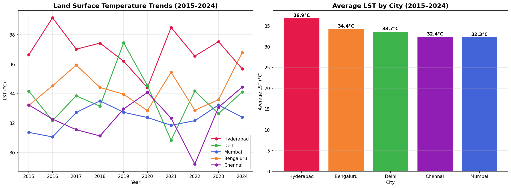
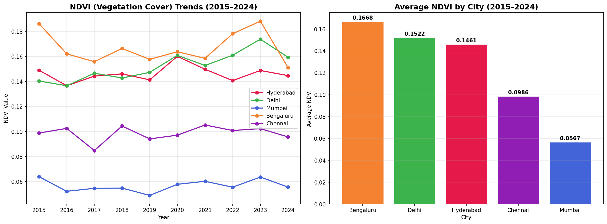
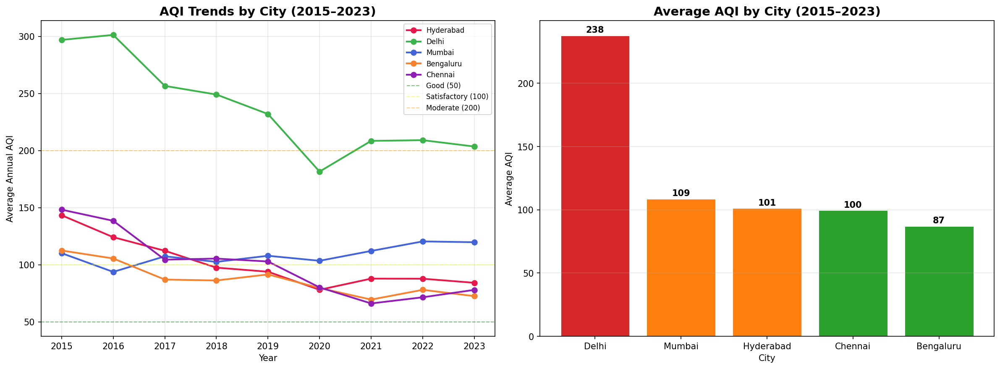
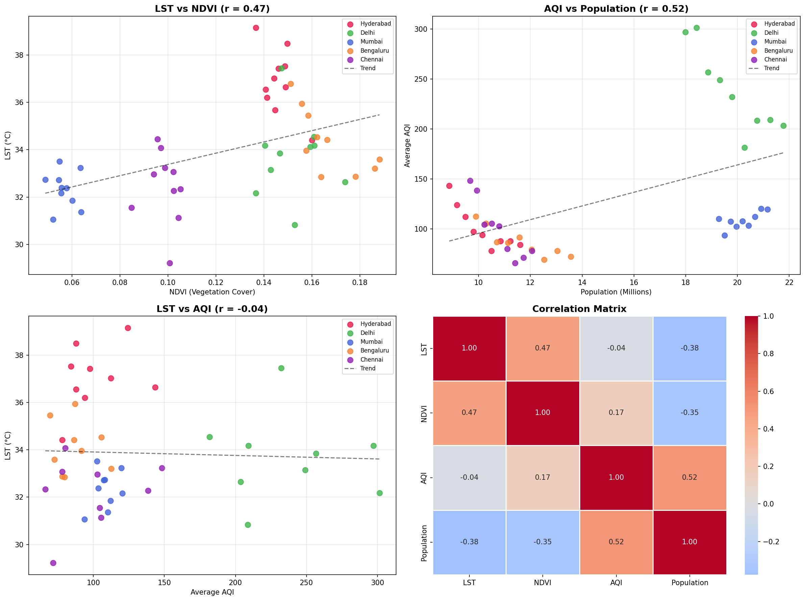
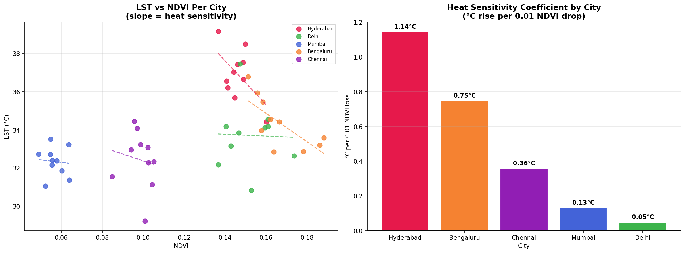
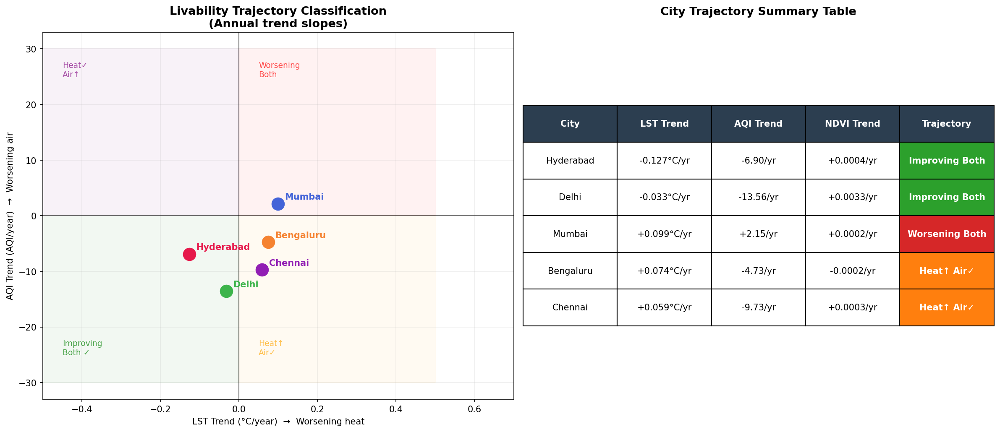
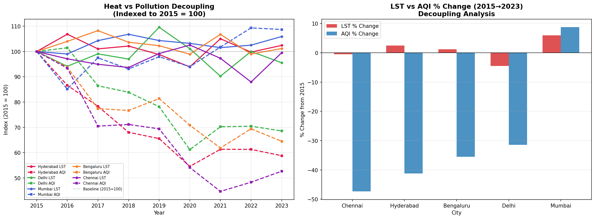

# Urban Heat & Livability Analysis — India (2015–2024)

A comparative data analysis of urban heat island intensity, vegetation 
cover, air quality, and livability trends across 5 major Indian metro 
cities using satellite remote sensing and ground-based AQI data.

## Cities Analyzed
Hyderabad | Delhi | Mumbai | Bengaluru | Chennai

## Data Sources
- **Land Surface Temperature & NDVI** — Landsat 8 Collection 2 (Google Earth Engine)
- **Air Quality Index (AQI)** — CPCB via Kaggle + UrbanEmissions.info (2015–2023)
- **Population** — Census of India 2001, 2011 (interpolated to yearly estimates)

## Key Findings
- **Bengaluru** is the fastest warming city (+3.58°C, 2015–2024) driven 
  by the steepest green cover loss (-0.035 NDVI)
- **Delhi** has the worst air quality (avg AQI 237) but showed the 
  strongest improvement (-31.4% AQI drop, 2015–2023)
- **Chennai** achieved the best heat-pollution decoupling — AQI fell 
  -47.4% with near-zero temperature change
- **Mumbai** is the only city worsening on both heat (+5.9%) and 
  air quality (+8.7%) simultaneously
- 4 of 5 cities successfully decoupled air quality improvement from 
  urban heat — a key policy finding

## Original Metrics Developed
- **Heat Sensitivity Coefficient** — °C rise per 0.01 NDVI drop (city-specific)
- **Livability Trajectory Classification** — 2×2 quadrant system based 
  on LST and AQI trend directions
- **Heat-Pollution Decoupling Index** — indexed comparison of relative 
  LST vs AQI change from baseline year

## Project Structure
- `data/raw/` — Original downloaded datasets
- `data/processed/` — Cleaned and merged datasets  
- `notebooks/` — Jupyter/Colab analysis notebook
- `images/` — All output charts and visualizations

## Interactive Dashboard
Coming soon — Tableau Public dashboard in progress.

## Tools & Technologies
| Category | Tools |
|---|---|
| Satellite Data | Google Earth Engine, Landsat 8 Collection 2 |
| Analysis | Python, Pandas, NumPy, SciPy |
| Visualization | Matplotlib, Seaborn |
| Dashboard | Tableau Public (in progress) |
| Environment | Google Colab |

## Visualizations

### LST Trends (2015–2024)

### NDVI (Green Cover) Trends (2015–2024)

### AQI Trends (2015–2023)

### Correlation Analysis

### Heat Sensitivity Coefficient

### Livability Trajectory Classification

### Heat-Pollution Decoupling Analysis

## Author
**Kiran Annavarapu**
- LinkedIn: [linkedin.com/in/YOUR_PROFILE](www.linkedin.com/in/annavarapu-kiran-7a3a5a256)
- GitHub: [github.com/Annavarapukiran](https://github.com/Annavarapukiran)
